# Submission by Code Gea(k)ss for HACK-ON

## Problem Statement 
Prevention of malpractice among students

## Approach
The COVID-19 pandemic has forced us to push our limits and find innovative ways to solve the problems of our communities. We took a small step towards providing a fair and easy-to-use assessment tool for the students of our community to give their tests online without stepping out of their homes and putting the lives of many at stake.

## Our Product - Proctorhat

Our project is divided into 2 segments:
* Website
* AI Proctoring

## Proctorhat Website

 &ensp;&ensp;&ensp;&ensp;&ensp;&ensp;&ensp;&ensp;&ensp;
 &ensp;&ensp;&ensp;&ensp;&ensp;&ensp;&ensp;&ensp;&ensp; 
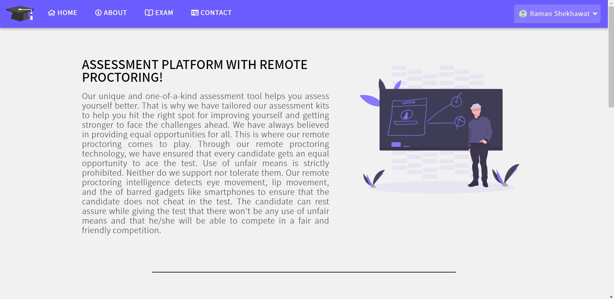 &ensp;&ensp;&ensp;&ensp;&ensp;&ensp;&ensp;&ensp;&ensp;
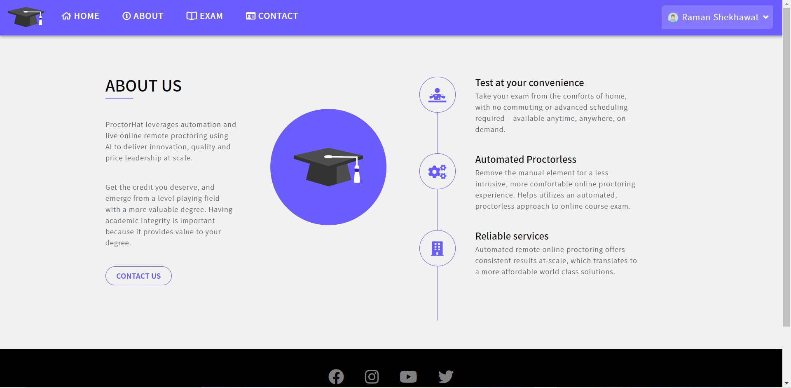 &ensp;&ensp;&ensp;&ensp;&ensp;&ensp;&ensp;&ensp;&ensp;
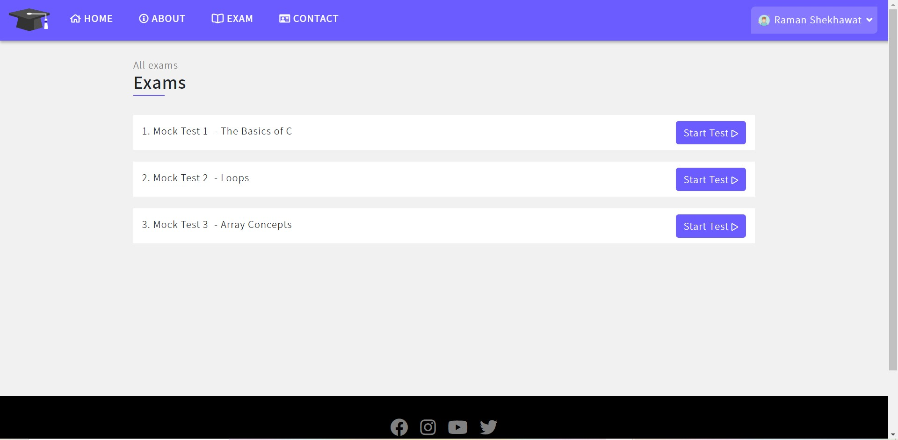 &ensp;&ensp;&ensp;&ensp;&ensp;&ensp;&ensp;&ensp;&ensp;
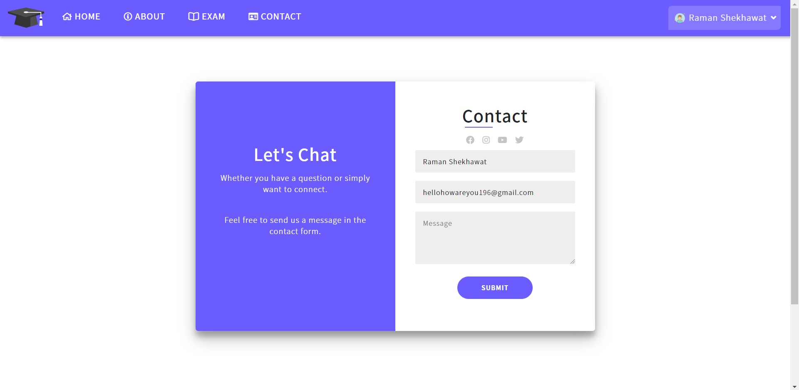 &ensp;&ensp;&ensp;&ensp;&ensp;&ensp;&ensp;&ensp;&ensp;
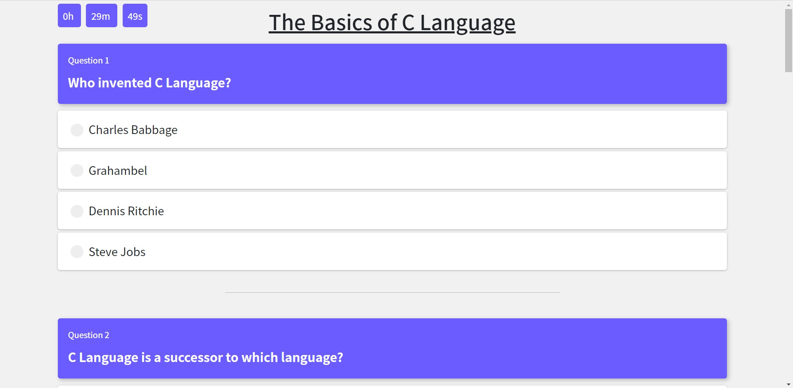 &ensp;&ensp;&ensp;&ensp;&ensp;&ensp;&ensp;&ensp;&ensp;
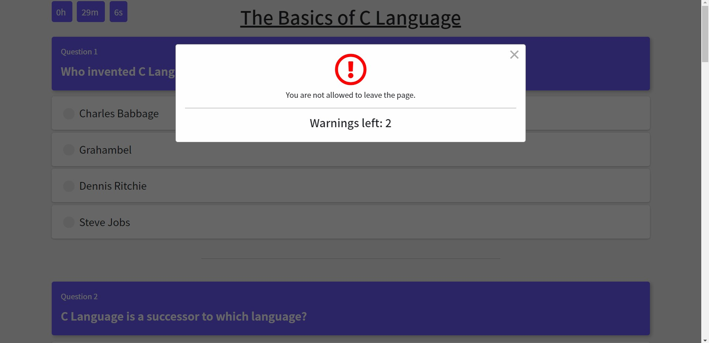 &ensp;&ensp;&ensp;&ensp;&ensp;&ensp;&ensp;&ensp;&ensp;

## AI Proctoring

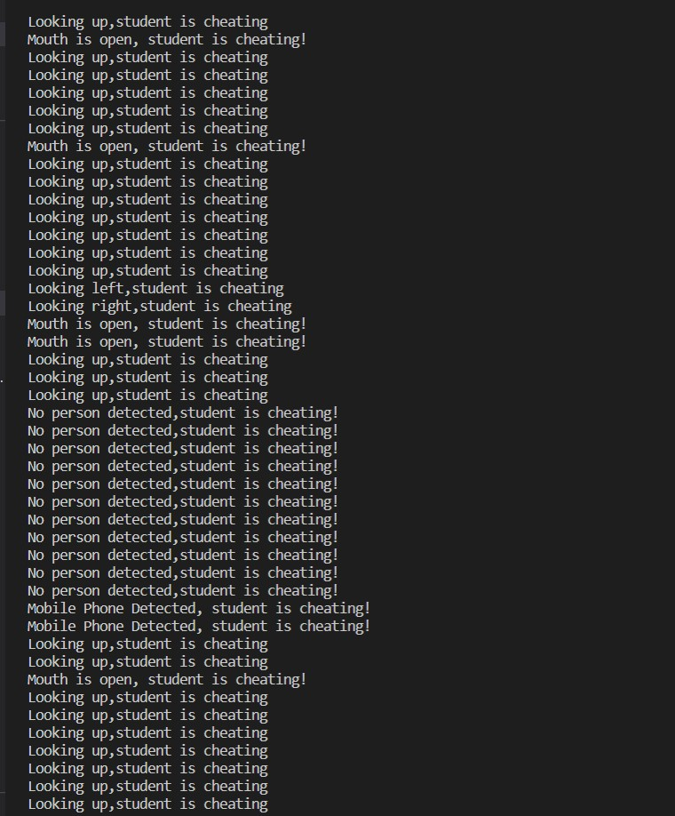 &ensp;&ensp;&ensp;&ensp;&ensp;&ensp;&ensp;&ensp;&ensp;
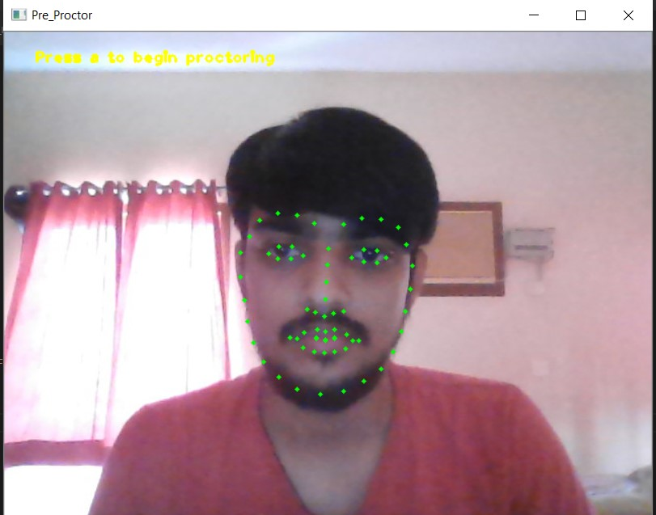 &ensp;&ensp;&ensp;&ensp;&ensp;&ensp;&ensp;&ensp;&ensp; 
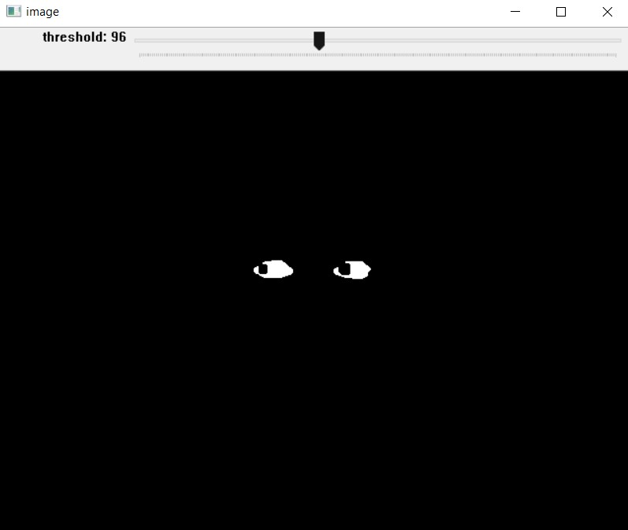 &ensp;&ensp;&ensp;&ensp;&ensp;&ensp;&ensp;&ensp;&ensp;
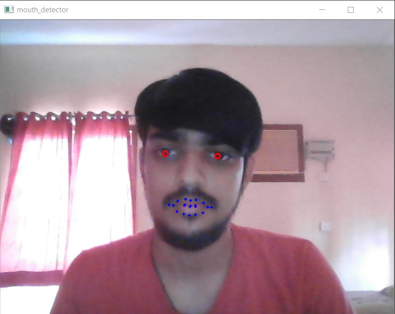 &ensp;&ensp;&ensp;&ensp;&ensp;&ensp;&ensp;&ensp;&ensp;
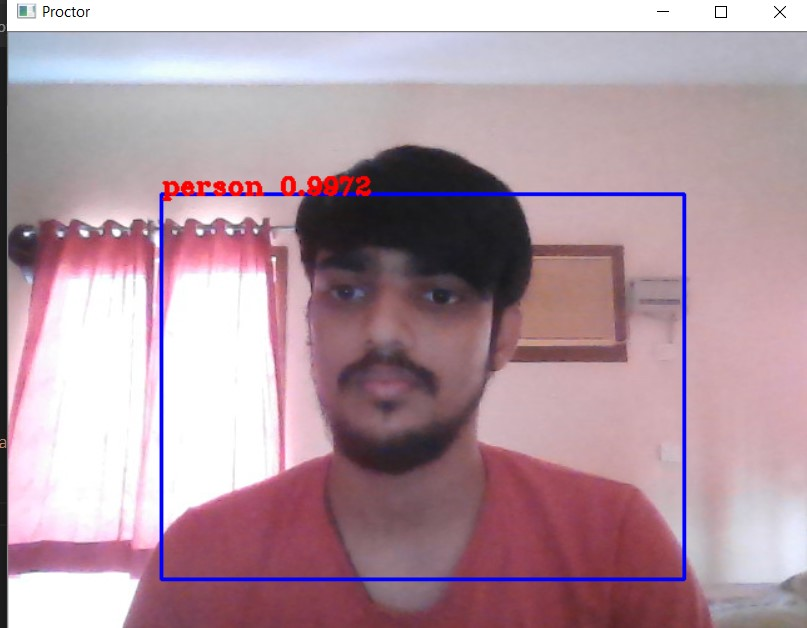 &ensp;&ensp;&ensp;&ensp;&ensp;&ensp;&ensp;&ensp;&ensp;
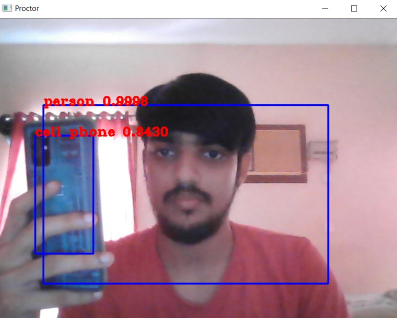 &ensp;&ensp;&ensp;&ensp;&ensp;&ensp;&ensp;&ensp;&ensp;

<h2 align= "left"><b>Have Fun With Our Product</b></h2>

- Website Link : https://proctorhat.herokuapp.com/
- Youtube Demo : https://youtu.be/xqUJ7gxj490

<h2 align= "left"><b>Tech Stack Used</b></h2>

*Web*
- eJS,CSS,Bootstrap
- JavaScript
- NodeJS,expressJS
- Firebase

*Computer Vision*
- Python
- OpenCV
- Numpy , Dlib 
- Tensorflow
- Keras

<h2 align= "left"><b>Project Maintainer(s)</b></h2>

<table>
<tr align="center">
  
  <td>
  
Rishikesh S

</td>

<td>

Mohammad Muazam

</td>

<td>
  
 <td>

Raman Shekhawat

</td>

<td>

<td>

Vikram Aditya

</td>
</tr>

  </table>

## License

